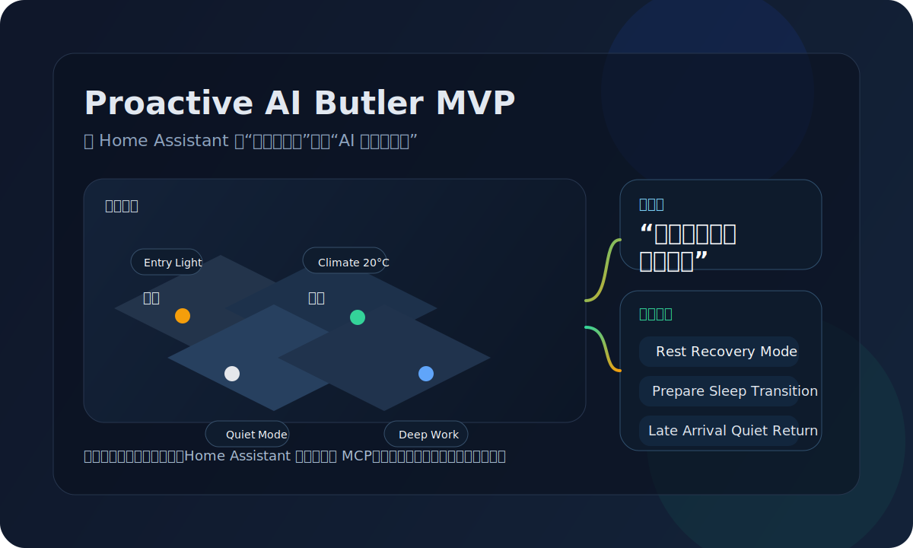
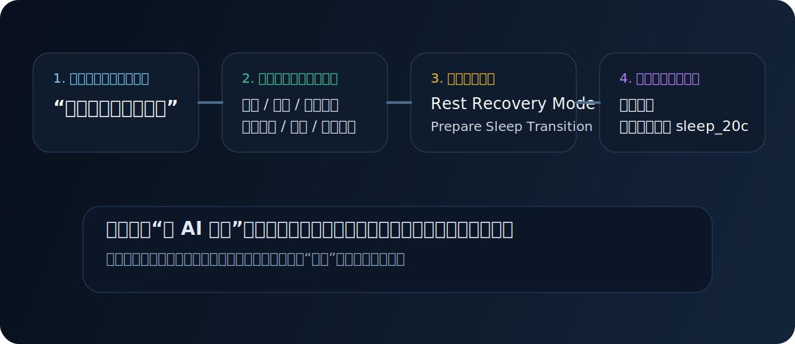
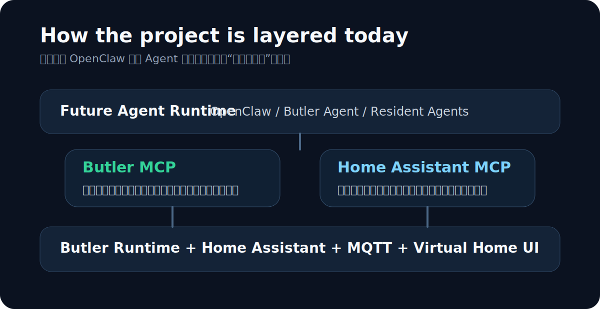

# Proactive AI Butler MVP

> A virtual smart home that is trying to become a real AI butler.



Most smart-home demos stop at “turn on the light.”

This project is trying to explore something more interesting:

- What if a home assistant could understand that you are tired, not just that you said a command?
- What if it could suggest a few good household scenes instead of waiting for exact button presses?
- What if agents could interact with a home through a stable runtime API and MCP, instead of drowning in raw entity names?

Right now, this repo is a **virtual household runtime** built on top of Home Assistant. It already has rooms, virtual devices, a pseudo-3D home view, scene suggestions, scene execution, and an external MCP surface that agents can call from outside the house.

It is not pretending to be a finished consumer product yet. It is a working playground for a future where Home Assistant feels less like a dashboard and more like a household operating system.

## Why It Feels Different



The current loop is intentionally simple, but it already points in the right direction:

1. A person expresses a high-level intent.
2. The system reads the current household context.
3. It proposes a few candidate scenes.
4. One scene is applied across multiple devices.

That means the interesting unit is no longer “device control.”
The interesting unit is **household intent**.

Today, the suggestion layer is still rule-driven rather than fully model-driven. That is a deliberate choice: it keeps the runtime predictable while the API, MCP layer, and Home Assistant integration are being stabilized.

## What You Can Already Do

- Walk around a virtual home and click devices in a pseudo-3D interface.
- See the same virtual devices show up inside Home Assistant.
- Control virtual `light`, `cover`, `lock`, `climate`, `mode`, and `reminder` entities.
- Ask for scene suggestions from natural-language inputs like `我今天很累，回家了`.
- Apply a high-level scene such as `rest_recovery_mode` and watch multiple device states update together.
- Access the household through a public MCP endpoint, which means an external agent can inspect and control the virtual home without custom per-device wiring.

## What Exists In The House Right Now

The current demo household includes:

- Rooms: `Bedroom`, `Living Room`, `Kitchen`, `Entry`, `Work Zone`
- A main resident with focus/quiet state
- Virtual lights, curtain, lock, climate, house mode, and reminder entities
- A Home Assistant integration path through MQTT
- A Butler runtime API for household summaries, scene suggestions, scene application, and execution history
- A separate Butler MCP server for agent-facing household tools

## The Shape Of The Stack



This separation matters.

The project is being built so that future agents do **not** need to directly reason over every Home Assistant entity. Instead:

- `Home Assistant` stays the device and state substrate.
- `Home Assistant MCP` is the low-level entity surface.
- `Butler Runtime` becomes the stable household API.
- `Butler MCP` exposes higher-level household tools.
- A future runtime such as `OpenClaw` can sit on top without needing to be hardcoded for every device.

That is the long-term bet: agents should operate on **household semantics**, not just raw switches.

## Current Demo Moments

Here are the kinds of flows that already work in the MVP:

| User situation | What the system can do today |
| --- | --- |
| “我今天很累，回家了” | Suggest `Rest Recovery Mode`, `Prepare Sleep Transition`, or `Late Arrival Quiet Return` |
| Quiet focus time in the study | Keep a focus-friendly mode active and suppress non-essential disruptions |
| A late return home | Turn on a soft arrival light and keep the house in a quieter state |
| Need a direct tool call | Use Butler MCP to read the home summary, list devices, or control a virtual device |

## Why This Project Exists

Home Assistant is already an excellent substrate for connected homes.

What it does not give you out of the box is a convincing answer to this question:

> How should an AI behave if it is supposed to feel like a careful household butler rather than a remote control?

This project exists to explore that space in a way that is:

- safe enough to test, because the first runtime controls virtual devices only
- visible enough to debug, because the home is observable in both UI and Home Assistant
- open enough to extend, because the house is exposed through HTTP APIs and MCP

## Project Status

This is the current state of the MVP:

- Virtual household runtime: working
- Home Assistant onboarding and MQTT discovery: working
- Controllable virtual devices inside HA: working
- Public Butler MCP endpoint: working
- Natural-language scene suggestion: working, currently rule-based
- External planner mode: scaffolded, still defaults to `mock`
- Real resident agents / director agents / OpenClaw runtime: not connected yet

## Quick Peek For Builders

If you want to run it locally, the shortest path is:

```bash
cp .env.example .env
DOCKER_BUILDKIT=0 COMPOSE_DOCKER_CLI_BUILD=0 docker compose up --build
```

Then open:

- Observer UI: `http://localhost:8787`
- Home Assistant: `http://localhost:8123`
- Butler MCP: `http://localhost:8790/mcp`

## For Agents And Integrators

The project already exposes a stable runtime surface:

- `GET /api/runtime/summary`
- `GET /api/runtime/devices`
- `GET /api/runtime/executions`
- `POST /api/runtime/device-commands`
- `POST /api/runtime/scene-suggestions`
- `POST /api/runtime/scenes/apply`

The companion Butler MCP currently includes:

- `household_summary_get`
- `devices_list`
- `device_command_send`
- `scene_suggestions_generate`
- `scene_apply`
- `executions_list_recent`

This is the part that will eventually make it easy to plug in a real butler agent runtime.

## What Comes Next

The near-term roadmap is not “add more buttons.”

It is:

- replace rule-based scene suggestion with model-backed scene suggestion
- add confirmation policies for higher-risk actions
- introduce resident agents and director agents
- connect an external runtime such as `OpenClaw`
- let the home feel less scripted and more like a living environment

If this works, the end result is not just another smart-home dashboard.
It is a testbed for figuring out what a trustworthy AI household butler should actually be.
